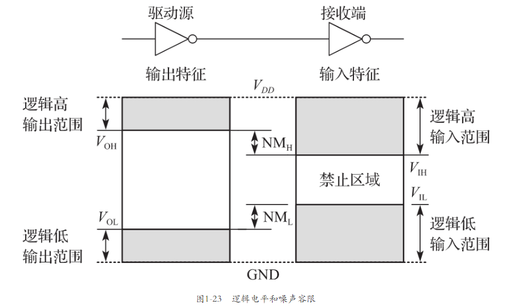
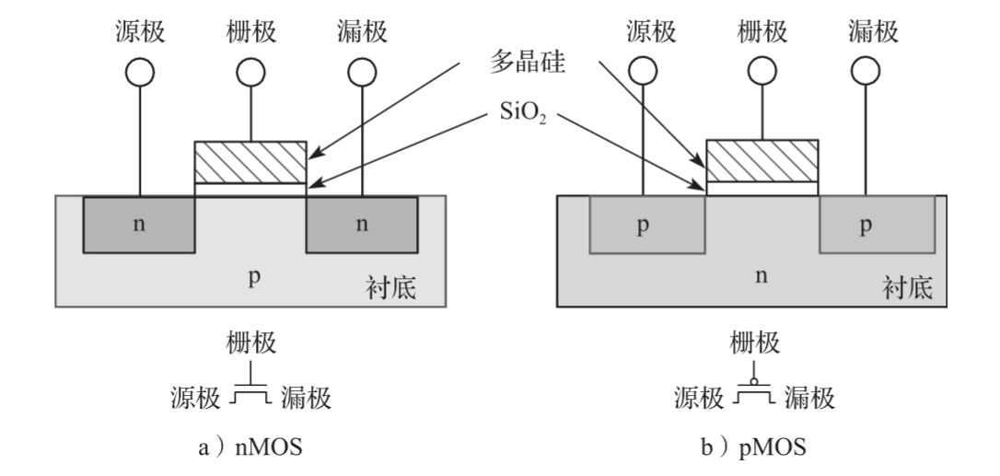
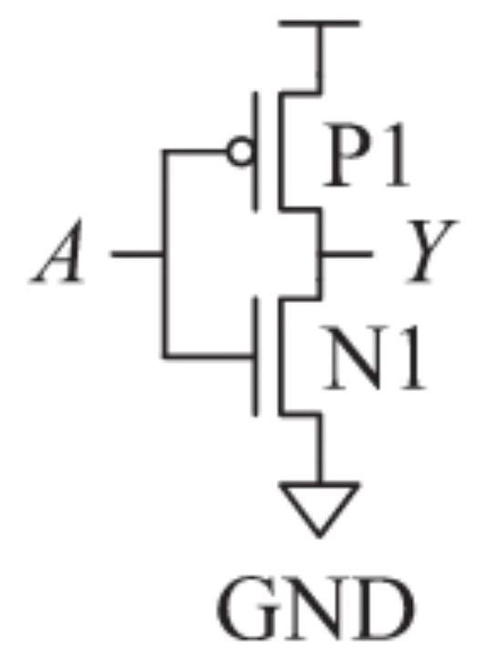
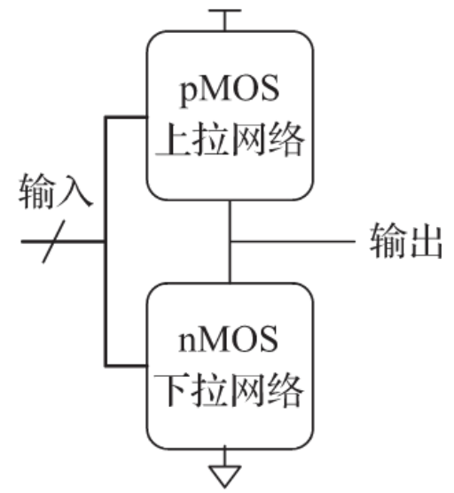

# 第1章 二进制

## 1.1 课程计划

## 1.2 管理复杂性的艺术

### 1.2.1 抽象

- 管理复杂性的关键技术在于抽象（abstraction）：隐蔽不重要的细节。
- 微结构（micro-architecture）将逻辑和体系结构层次的抽象连接在一起。体系结构（architecture）层描述了程序员观点的计算机抽象。

### 1.2.2 约束

- 约束（discipline）是对设计选择的一种内在限制，通过这种限制可以更有效地在更高的抽象层次上工作。

### 1.2.3 三条原则

- 除了抽象和约束外，设计者还使用另外三条原则来管理系统的复杂性：层次化（hierar-chy）、模块化（modularity）和规整化（regularity）。
- 层次化：将系统划分为若干模块，然后更进一步划分每个模块，直到这些模块都很容易理解。
- 模块化：所有模块有定义好的功能和接口，以便于它们之间可以很容易地相互连接而不会产生意想不到的副作用。
- 规整化：在模块之间寻求一致，通用的模块可以重新使用多次，以减少设计不同模块的数量。

## 1.3 数字抽象

- 数字系统使用离散值变量（discrete-valued variable）来表示信息，也就是说，变量是有限数目的不同离散值。

## 1.4 数字系统

### 1.4.1 十进制数

### 1.4.2 二进制数

### 1.4.3 十六进制数

### 1.4.4 字节、半字节和字

- 8个一组的比特位称为字节（byte），它能表示28=256个数字。
- 4个一组的比特位或者半个字节称为半字节（nibble），它能表示24=16个数字。
- 微处理器处理的一块数据称为字（word）。字的大小取决于微处理器的结构。
- 在一组位中，权为1的那一位称为最低有效位（least significant bit，lsb），处于另一端的位称为最高有效位（most significant bit，msb）
- 1024字节称为1千字节（kilobyte，KB）。1024比特称为1千比特（kilobit、Kb或Kbit）。类似地，MB、Mb、GB和Gb分别叫作兆字节、兆比特、吉字节和吉比特。

### 1.4.5 二进制加法

### 1.4.6 有符号的二进制数

- 一个N位带符号的原码数中的最高位为符号位，剩下的N-1位为数值（绝对值）。符号位为0表示正数，1表示负数。
- 二进制补码的符号位在求二进制补码（taking the two’s complement）的过程中保持不变。在此过程中首先对数据的每一位取反，然后在数据的最低位加1。
- 当进行N位的数据加法时，第N位的进位（即第N+1位结果）被抛弃。

## 1.5 逻辑门

### 1.5.1 非门

### 1.5.2 缓冲

从逻辑的角度看，缓冲和电线没有差异，好像没有用。然而，从模拟电路的角度看，缓冲可能有一些很好的特征使得它可以向电机传递大电流，或者将输出更快地传递到多个门的输入上。

### 1.5.3 与门

### 1.5.4 或门

### 1.5.5 其他二输入逻辑门

### 1.5.6 多输入门

## 1.6 数字抽象之下

### 1.6.1 电源电压

- 系统中最低的电压为0V，称为地（ground，GND）。系统中最高的电压来自电源，常称为VDD。

### 1.6.2 逻辑电平

  

### 1.6.3 噪声容限

低电平和高电平的噪声容限分别为：NML=VIL-VOL （1.2）NMH=VOH-VIH （1.3）

### 1.6.4 直流电压传输特性

一种选择逻辑电平的合理方法是选择在传输特征曲线斜率dV(Y)/dV(A)为-1的位置。这两个位置称为单位增益点（unity gain point）。

### 1.6.5 静态约束

VDD和逻辑电平可以任意选择，但是所有相互通信的逻辑门必须保持兼容的逻辑电平。因此，逻辑门可以按照逻辑系列（logic family）来区分，其中同一逻辑系列的所有门都遵循相同的静态约束。

## 1.7 CMOS晶体管

### 1.7.1 半导体

### 1.7.2 二极管

p类硅和n类硅之间的连接点称为二极管（diode）。p类区域为阳极（anode），n类区域为阴极（cathode），如图1-27所示。当阳极的电压高于阴极时，二极管处于正向偏压，电流从阳极流向阴极。当阳极的电压低于阴极时，二极管处于反向偏压，没有电流流动。二极管符号表示了电流仅能沿一个方向流动。

### 1.7.3 电容

电容（capacitor）由夹着绝缘体的两片导体构成。当电压V加到电容一端的导体时，这个导体将积累电荷Q，而另一端导体将积累电荷-Q

### 1.7.4 nMOS和pMOS晶体管

nMOS晶体管在p型衬底上由两个与栅极相连的n类型掺杂区域，分别称为源极（source）和漏极（drain）。pMOS晶体管刚刚相反，在n型衬底上构造p型源极和漏极。

- 当电压足够大时，大量的负电荷积聚在栅极下层，使得此区域从p型反转为n型。这个反转区域称为沟道（channel）。此时就有了一个从n型源极经n型沟道到n型漏极之间的通路，电流就可以从源极流到漏极，晶体管就处于导通状态。
- pMOS晶体管的工作方式刚刚相反，也可以从图1-31的电路符号上看出。pMOS晶体管的衬底电压为VDD，当栅极电压为VDD时，处于截止状态。当栅极接地时，沟道反转为p类型，处于导通状态。

### 1.7.5 CMOS非门

  

### 1.7.6 其他CMOS逻辑门

  

## 后记

显然现在写博客这种方式已经不能提升我复习的进度了，计算机组成原理是一门偏向理解应用的学科，如果有时间写写博客来复习时很好，但我现在显然没时间了，所以之后就不会有这一个系列的更新了，直接看书效率可能会更高一点。
